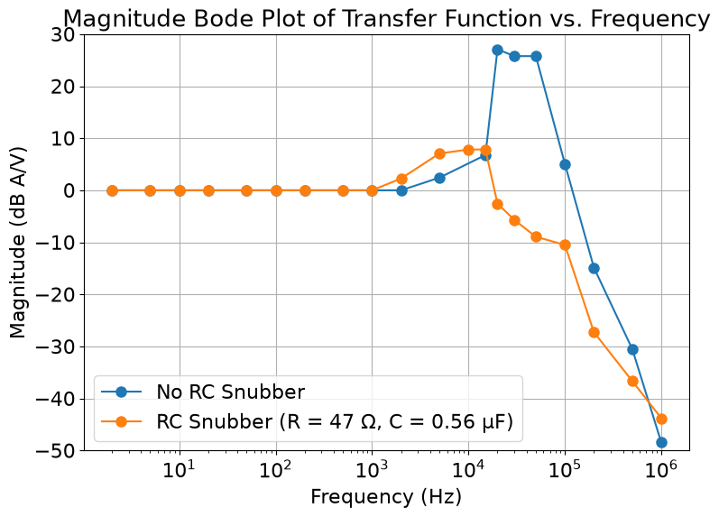

# 6-channel-3A-current-supply
This is a 6 channel current source, which can deliver up to 3A per channel. The current box is powered with Xantrex XKW 20-50 DC Power Supply, and is controlled using linduino (DC2026C) and LTC2668 (16 channel DAC, integrated onto the evaluation board DC2025A-A). The DAC is powered with RIGOL DP832 power supply.
## Design
The figure below shows the circuit diagram for one channel. The op-amp model is OPA541. For any user defined voltage to the input pin, there will be a current with the same magnitude as the input voltage running through the load due to the usage of 1 Ohms sensing resistor. This current supply box was originally designed to power the shim coils, so the load in this diagram is the 1.8 mH shim coil. A sample coil with approximately the same inductance was made in the testing stage.

In the figure below, the top silver box is the current supply box. There are three power pins on the left (positive and negative rail of the op-amp (red and green), and a ground (black)), and 6 output channels in the middle (positive current means current flowing from red to black). There is also a DP-9 port that can be connected to the linduino + DAC box. 

The middle box is the linduino + DACs. The DP-9 connector is on the left, and the red/green/black correspond to +5V/-5V/ground to power the DACs. Lastly, the bottom component is the Xantrex power supply.

The DP-9 connector connects the 6 output pins from the DACs to the 6 input pins on the op-amps. The common ground pin of the DACs is also connected to the ground of the current supply box (the black connector on the box) through the DP-9 connector.

### An observation with powering the op-amp
The op-amp is powered with Xantrex XKW 20-50 DC Power Supply, where the difference between the positive power rail and the negative power rail of the op-amp is 10V. However, we found that if we connect the ground of the linduino+DACs to the negative rail of the op-amp (so the op-amp is powered with 10V and 0V) and send positive input voltage to the op-amp, the op-amp failed to drive positive current across the load. But if we connect the ground of the linduino+DACs to the positive rail of the op-amp (so the op-amp is powered with 0V and -10V) and send negative input voltage to the op-amp, the op-amp is able to drive negative current through the load. 

Since we can always reverse the output pins to flip the current direction, this issue does not affect the operation.

### Purpose of the RC snubber parallel to the load
In the first figure, we can see a 47 Ohms + 0.56 uF RC snubber parallel to the load. This is recommanded for an inductive load. In reality, there is always some parasitic capacitance in parallel to the load, so the LC circuit leads to an oscillation. Whenever we make a change to the input, the output current will start to oscillate before it becomes more stable. The additional RC snubber damp out this ringing behaviour, which can reduce the settling time for coil voltage and current in response to input changes. 

In the figures below, the purple curve show the voltage across the coil (the difference between the voltages above and below the coil, which are the pink and dark blue curves) before and after the RC snubber. The light blue curve is the input pulse.

To better illustrate the damping effect, the figure below shows the magnitude bode plot of the transfer function. Different frequencies of sine waves with amplitude 250 mV were sent to the DAC input, and the responses of the coil current were measured. The transfer function is I_coil / V_in, where I_coil is the current through the coil and V_in is the input to the DAC input pin. To measure the coil current, a 1Ohms sensing resistor was placed in series with the coil. The voltage across the coil was measured as V_sens, and I_coil = V_sens / 1 Ohms. For the input, all measured voltages correspond to the amplitude of the signal.

### Heat dissipation
When operating all six channels at the designed maximum load --- 3A, the Xantrex is delivering 18A * 10V = 180W of power into the box. The heat dissipated onto the 1 Ohm sensing resistors is 6 * (3A)
^2 * 1 Ohms = 54W, so in the extreme case, the power dissipated to the op-amps is 180W - 54W = 126W.

The figure below shows the structure inside the box. We are using two heat sinks made by alunimum with 3 op-amps sitting on each of them. Additionally, we are adding a MULTICOMP MC1123HBT AC fan, which can deliver 107 Cubic feet per minute of air into the box.

We operated the current box for 4 hours, where the loads are six 0.1 Ohms resistor with -3A across all of them. The output current was measured using a multimeter, and the current readings were stable within the multimeter resolution.

